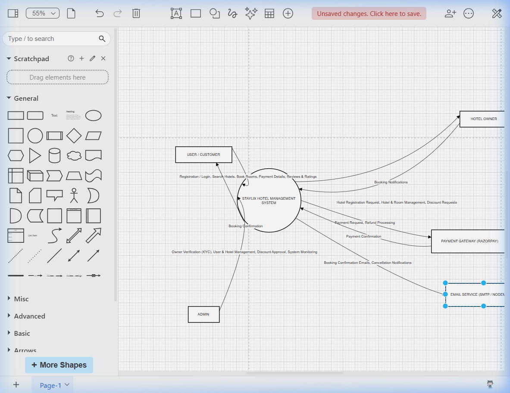

# Staylix – Professional Property & Hotel Booking Platform

Staylix is a high-performance, full-stack application designed to modernize the property booking experience. Built using the MERN (MongoDB, Express, React, Node.js) stack, it provides a unified platform for travelers to find accommodations, property owners to list their services, and administrators to maintain the ecosystem.

---

## 🏛️ College Profile

> [!NOTE]
> **Institution:** [Your College Name Here]
> **Department:** Computer Science / Information Technology
> **Academic Year:** 2025-2026
> **Location:** [Your City, State]

---

## 📝 Project Profile

- **Project Title:** Staylix – Property Booking Platform
- **Developed By:** [Your Name / Team Members]
- **Project Guide:** [Name of Mentor/Guide]
- **Platform:** Web (Responsive Single Page Application)
- **Database:** NoSQL (MongoDB)

---

## 📖 Introduction

Staylix addresses the challenges of traditional hotel booking by providing a transparent, map-integrated, and secure online environment. It leverages modern web technologies to ensure low latency, interactive search experiences, and robust transaction handling. The system caters to three primary personas: **Users (Travelers)**, **Owners (Hoteliers)**, and **Administrators**.

---

## 🛠️ Project Description

The Staylix project is a comprehensive solution for the hospitality industry. It features:
- **Interactive Map Search:** Users can visually locate properties on a map.
- **Dynamic Inventory:** Real-time availability tracking for rooms.
- **Financial Integration:** Secure payments via Razorpay API.
- **Verification System:** KYC-based onboarding for property owners.
- **Business Intelligence:** Data-driven dashboards for owners and admins.

---

## 💻 Environment Description

- **Operating System:** Windows 10/11 (Development Environment)
- **Integrated Development Environment (IDE):** Visual Studio Code
- **Version Control:** Git & GitHub
- **Package Manager:** NPM (Node Package Manager)
- **Browser:** Google Chrome (for testing and debugging)

---

## 🔌 Hardware and Software Requirements

### **Hardware Requirements**
- **Processor:** Intel Core i5 or higher (AMD equivalent)
- **RAM:** Minimum 8GB (16GB recommended)
- **Storage:** 500MB free disk space for project files
- **Internet:** Active connection for API integrations (Razorpay, MongoDB Atlas)

### **Software Requirements**
- **Node.js:** v18.x or higher
- **Database:** MongoDB Community Server or MongoDB Atlas
- **Frontend Framework:** React 19 (Vite)
- **Backend Framework:** Express.js 5.x

---

## 🚀 Technologies Used

### **Frontend (Client)**
- **React.js:** Component-driven UI development.
- **Redux Toolkit:** Centralized state management for auth and data.
- **Leaflet:** Interactive mapping engine.
- **Recharts:** Analytics and data visualization.
- **Axios:** Asynchronous API communication.

### **Backend (Server)**
- **Node.js:** High-performance JavaScript runtime.
- **Express.js:** Lightweight web framework.
- **MongoDB & Mongoose:** Scalable NoSQL database with schema modeling.
- **JWT:** JSON Web Tokens for stateless authentication.
- **Razorpay SDK:** Payment gateway integration.
- **Nodemailer:** Automated email delivery system.

---

## 📊 System Analysis and Planning

### **Existing System and its Drawbacks**
The traditional property booking process often relies on manual entries, phone calls, or fragmented websites.
- **Lack of Transparency:** Real-time availability is rarely accurate.
- **Static Search:** Inability to see property proximity to landmarks visually.
- **Insecure Payments:** Reliance on cash or unverified bank transfers.
- **Manual Management:** Owners struggle to track multiple bookings without a digital dashboard.

### **Feasibility Study**
1. **Technical Feasibility:** The MERN stack is highly suitable for building scalable, real-time web applications.
2. **Economic Feasibility:** Open-source tools (Node, React) and free tiers for databases reduce initial development costs.
3. **Operational Feasibility:** The interface is designed for non-technical users, ensuring high adoption rates.

### **Requirement Gathering and Analysis**
- **Functional Requirements:** User registration, property search, map views, booking flow, payment processing, KYC approval.
- **Non-Functional Requirements:** Security (SSL, JWT), Performance (<2s load time), Scalability, and UI responsiveness.

---

## ✨ Proposed System

Staylix proposes a centralized, secure, and highly interactive digital marketplace.
- **Users** can search, filter, and book rooms with instant confirmation.
- **Owners** get a dedicated portal to manage listings and track earnings.
- **Admins** maintain quality control through verification and moderation tools.

---

## 🔭 Scope

### **Current Scope**
- Complete property and room management lifecycle.
- Map-based discovery and geolocation.
- Secure payment integration.
- Analytics for business owners.

### **Future Scope**
- **AI Recommendations:** Personalized suggestions based on travel history.
- **Real-time Chat:** Instant messaging between users and owners.
- **Multi-currency Support:** Global payment accessibility.
- **Mobile Application:** Native iOS and Android apps.

---

## 📦 Project Modules

### **1. User Module**
- **Discovery:** Filter by location, price, and amenities.
- **Map View:** Toggle between list and map for spatial awareness.
- **Booking:** Intuitive room selection and date picking.
- **Payment:** Integrated checkout with Razorpay.
- **Reviews:** Rating and feedback system for post-stay.

### **2. Owner Module**
- **Registration:** Formal KYC request to join the platform.
- **Dashboard:** Overview of bookings, active listings, and revenue.
- **Inventory:** Add/Edit hotels and specific room types.
- **Management:** View and manage incoming booking requests.

### **3. Admin Module**
- **Verification:** Approve or reject owner registration requests.
- **Analytics:** Platform-wide performance reports (Revenue, User Growth).
- **Moderation:** Management of users, listings, and global settings.

---

## ✅ Expected Advantages

- **Efficiency:** Drastic reduction in booking time.
- **Accuracy:** Real-time syncing of room inventory.
- **Security:** Industry-standard encryption for user data and payments.
- **Visualization:** Map integration helps in better decision-making.

---

## 📐 Detail Planning

### **Data Flow Diagrams (DFD)**
The system logic is divided into hierarchical levels:
- **Level 0 (Context):** Overall interaction between entities.
- **Level 1:** Module-specific data transitions.



> [!TIP]
> **Editable Diagram:** Download [staylix_dfd.drawio](docs/assets/staylix_dfd.drawio) and open on [app.diagrams.net](https://app.diagrams.net/).

### **Process Specification**
- **Booking Process:** Room Selected -> Date Validated -> Payment Initiated -> Callback Received -> Status Updated to 'Confirmed'.
- **Owner Verification:** Request Submitted -> Admin Review -> Status Updated -> Permissions Granted.

### **Data Dictionary**
| Entity | Key Fields | Data Type | Description |
| :--- | :--- | :--- | :--- |
| **User** | `name`, `email`, `password`, `role` | String | Core user profile data. |
| **Hotel** | `name`, `location`, `description`, `images` | Obj/Array | Property infrastructure details. |
| **Room** | `type`, `price`, `capacity`, `hotelId` | Number/ID | Inventory specifications. |
| **Booking** | `checkIn`, `checkOut`, `amount`, `status` | Date/Num | Transaction and stay details. |

### **Entity-Relationship Diagram (ERD)**
- **User (1) <-> Booking (M)**
- **Hotel (1) <-> Room (M)**
- **Owner (1) <-> Hotel (M)**
- **Hotel (1) <-> Review (M)**

---

## 🏗️ System Design

### **Database Design (MongoDB Collections)**
- `users`: Stores account information and roles.
- `hotels`: Contains property profiles and locations.
- `rooms`: Specific room categories and pricing.
- `bookings`: Records of all transactions and stays.
- `ownerrequests`: Tracks KYC applications.

### **Directory Structure**
```text
staylix/
├── client/                 # Frontend (React + Vite)
│   ├── public/             # Static files
│   └── src/
│       ├── components/     # UI building blocks
│       ├── pages/          # Admin, Owner, User views
│       ├── store/          # Redux state management
│       └── services/       # API integration layers
├── server/                 # Backend (Node + Express)
│   ├── src/
│   │   ├── controllers/    # Business logic
│   │   ├── models/         # Mongoose schemas
│   │   ├── routes/         # API endpoints
│   │   └── middleware/     # Security guards
│   └── uploads/            # Local Image storage
└── package.json            # Configuration
```

### **API Modules**
| Module | Endpoint | Method | Purpose |
| :--- | :--- | :--- | :--- |
| **Auth** | `/api/auth` | POST | Login / Register |
| **Hotels** | `/api/hotels` | GET | Property Search |
| **Bookings** | `/api/bookings` | POST | Initiate Transaction |
| **Admin** | `/api/admin` | GET | System Statistics |

---

## 🧪 System Testing

### **Automated Tests**
The system includes dedicated scripts to verify core logic:
- `test-booking-overlap.js`: Validates room availability algorithms.
- `test-email.js`: Verifies SMTP configuration for notifications.
- `test-dates.js`: Ensures date normalization across time zones.

### **Manual Verification**
- **Cross-browser Testing:** Verified on Chrome, Edge, and Firefox.
- **Responsiveness:** Tested on mobile, tablet, and desktop viewports.
- **Payment Flow:** Validating Razorpay checkout in Test Mode.

---

## 🚧 Limitations and Future Scope

- **Current Limitations:** Highly dependent on external APIs (Maps, Razorpay); Currently no multi-language support.
- **Future:** Integration of AI for predictive pricing and multilingual interfaces to cater to global tourism.

---

## 📚 References

1. **React Documentation:** [react.dev](https://react.dev/)
2. **Node.js Manual:** [nodejs.org](https://nodejs.org/)
3. **MongoDB University:** [learn.mongodb.com](https://learn.mongodb.com/)
4. **Razorpay API Guide:** [razorpay.com/docs](https://razorpay.com/docs/)

---

© 2026 Staylix - All Rights Reserved.
