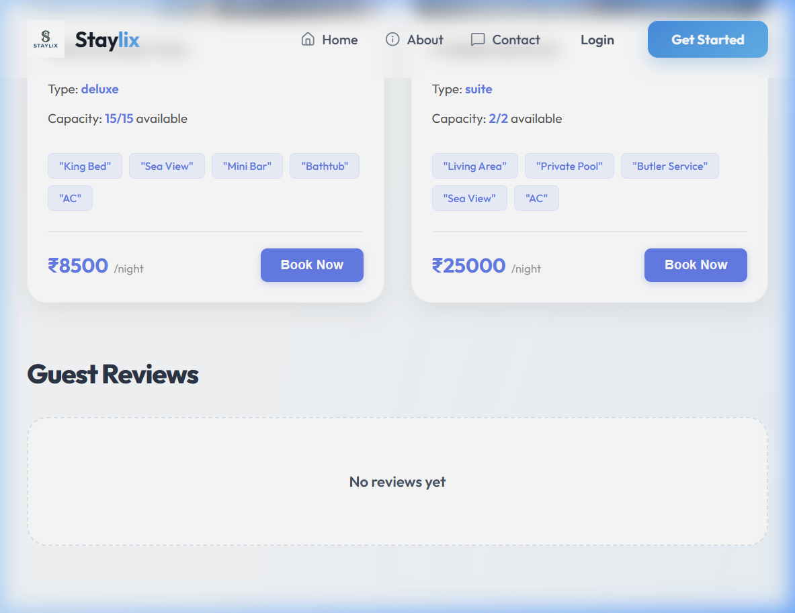

# Staylix – Property / Hotel Booking Platform

Staylix is a professional, full-stack property booking platform designed to provide a seamless experience for users searching for accommodations, property owners managing their listings, and administrators overseeing the platform. The system integrates advanced features like interactive map searches, secure online payments via Razorpay, and automated email notifications.

---

## 🏗 System Architecture (Level 0 DFD)

Below is the **Context Level (Level 0) Data Flow Diagram** for the Staylix system, illustrating the data exchange between the central system and external entities.


> [!TIP]
> **Editable Diagram:** You can download the editable [Staylix_Professional_DFD.drawio](docs/assets/staylix_dfd.drawio) and open it on [app.diagrams.net](https://app.diagrams.net/).

---

## 📝 Project Overview

Staylix serves as a bridge between travelers and property owners. Built with the MERN stack, it offers a robust solution for:
- **Users:** To discover, visualize on maps, and book properties with secure payment processing.
- **Owners:** To list their properties, manage availability, and track booking requests.
- **Admins:** To moderate the platform, verify owner requests (KYC), and analyze system-wide performance via a data-driven dashboard.

## ✅ Verified Functionality

The following screenshots demonstrate the project's verified features during a live system test:

| Feature | Visual Proof |
| :--- | :--- |
| **Hotel Details & Rooms** |  |

---

## ✨ Key Features

### 👤 User Module
- **Intuitive Search:** Filter properties by location, dates, and guest capacity.
- **Map Integration:** View property locations interactively using Leaflet maps.
- **Secure Booking:** Seamless room selection and booking process.
- **Online Payments:** Integrated Razorpay gateway for safe transactions.
- **Booking Management:** View order history and perform cancellations.
- **Feedback:** Provide ratings and reviews for hotels post-stay.

### 🏠 Owner Module
- **Owner Onboarding:** Formal request system to become a verified property owner.
- **Property Management:** Add, edit, and upload high-quality images for property listings.
- **Inventory Control:** Manage room types, pricing, and real-time availability.
- **Request Tracking:** Monitor and manage incoming booking requests.
- **Promotion Tools:** Propose discount codes for hotel-specific deals.

### 🛡️ Admin Module
- **KYC Verification:** Review and approve/reject property owner registration requests.
- **Content Moderation:** Comprehensive management of users, hotels, and rooms.
- **Analytics Dashboard:** Visualized reports on revenue, user growth, and bookings using Recharts.
- **Promotion Management:** Approve and regulate platform-wide or hotel-specific discounts.

---

## 🛠 Technology Stack

### **Frontend**
- **React.js** (Vite) - Component-based UI library.
- **Redux Toolkit** - Predictable state management.
- **React Router DOM** - Declarative routing.
- **Axios** - HTTP client for backend communication.
- **Leaflet & React Leaflet** - Interactive maps and geolocations.
- **Recharts** - Data visualization for analytics.
- **Lucide React** - Premium icon set.

### **Backend**
- **Node.js & Express.js** - Server-side runtime and framework.
- **MongoDB & Mongoose** - NoSQL database and object modeling.
- **JWT & Bcryptjs** - Secure authentication and password hashing.
- **Joi** - Robust data validation.
- **Multer** - Handling image and file uploads.
- **Nodemailer** - Professional email notification service.
- **Razorpay** - Integrated payment gateway SDK.

---

## 📦 Dependency Explanations

### **Frontend Dependencies**
| Library | Purpose |
| :--- | :--- |
| `@reduxjs/toolkit` | Simplifies Redux logic and manages global app state (Auth, UI, etc.). |
| `axios` | Facilitates asynchronous HTTP requests to the backend API. |
| `joi` | Used for client-side schema validation to ensure data integrity before submission. |
| `leaflet` | The core engine for rendering interactive maps. |
| `lucide-react` | Provides a consistent and modern icon set for the user interface. |
| `react` | The fundamental library for building the single-page application. |
| `react-datepicker` | A user-friendly component for selecting check-in and check-out dates. |
| `react-dom` | Handles the rendering of React components into the browser's DOM. |
| `react-hot-toast` | Lightweight and beautiful notification alerts. |
| `react-leaflet` | Provides React bindings for Leaflet to easily integrate maps in components. |
| `react-redux` | Connects the React components with the Redux store. |
| `react-router-dom` | Manages navigation and URL routing across the application. |
| `react-toastify` | Alternative notification system for robust toast messages. |
| `recharts` | Used for creating responsive charts in the Admin and Owner dashboards. |
| `sweetalert2` | Used for professional-looking confirmation dialogs and alerts. |

### **Backend Dependencies**
| Library | Purpose |
| :--- | :--- |
| `bcryptjs` | Hashes user passwords to ensure they are stored securely in the database. |
| `cors` | Enables Cross-Origin Resource Sharing for communication with the frontend. |
| `dotenv` | Manages environment variables to keep sensitive configuration separate from code. |
| `express` | The web framework used to build the RESTful API endpoints. |
| `joi` | Validates incoming request data to prevent malicious or malformed input. |
| `jsonwebtoken` | Generates and verifies tokens for secure user sessions and authorization. |
| `mongoose` | An ODM that provides a schema-based solution to model application data. |
| `morgan` | Logs HTTP requests to the console for easier debugging during development. |
| `multer` | Facilitates the uploading of hotel and room images to the server. |
| `nodemailer` | Sends transaction-based emails like booking confirmations and alerts. |
| `razorpay` | Communicates with Razorpay APIs to create orders and process payments. |

---

## 🏗 Project Architecture

Staylix follows a **Client-Server Architecture**:
- **Client (Frontend):** A Single Page Application (SPA) that handles the UI/UX and communicates with the backend via REST APIs.
- **Server (Backend):** A Node.js API that processes business logic, interacts with the MongoDB database, and integrates with external services (Razorpay, SMTP).

---

## 📂 Folder Structure

```text
staylix/
├── client/                 # Frontend Application
│   ├── src/
│   │   ├── components/     # Reusable UI components
│   │   ├── pages/          # Full page views (Admin, Owner, User)
│   │   ├── store/          # Redux Toolkit slices and store
│   │   ├── hooks/          # Custom React hooks
│   │   ├── context/        # React Context providers
│   │   ├── services/       # API interaction logic
│   │   └── utils/          # Helper functions
│   └── public/             # Static assets
├── server/                 # Backend API
│   ├── src/
│   │   ├── controllers/    # Request handling logic
│   │   ├── models/         # Mongoose schemas (User, Hotel, Room)
│   │   ├── routes/         # API endpoint definitions
│   │   ├── middlewares/    # Auth and validation middlewares
│   │   ├── config/         # Database and service configuration
│   │   └── utils/          # Generic utility functions
│   └── uploads/            # Storage for property images
└── package.json            # Root package configuration
```

---

## 🚀 Installation Guide

### **Prerequisites**
- **Node.js** (v18 or higher recommended)
- **MongoDB** (Local or Atlas)
- **NPM** (Node Package Manager)

### **Step 1: Clone the Repository**
```bash
git clone <repository-url>
cd staylix
```

### **Step 2: Backend Setup**
1. Navigate to the server folder:
   ```bash
   cd server
   ```
2. Install dependencies:
   ```bash
   npm install
   ```
3. Initialize the environment variables (see below).
4. Seed initial data (optional):
   ```bash
   node seed-locations.js
   ```

### **Step 3: Frontend Setup**
1. Navigate to the client folder:
   ```bash
   cd ../client
   ```
2. Install dependencies:
   ```bash
   npm install
   ```

---

## ⚙️ Environment Variables Setup

### **Server (.env)**
Create a file named `.env` in the `server` directory and add the following:

```env
PORT=5000
MONGO_URI=your_mongodb_connection_string
JWT_SECRET=your_jwt_secret_key
FRONTEND_URL=http://localhost:5173

# Razorpay Configuration
RAZORPAY_KEY_ID=your_razorpay_key_id
RAZORPAY_KEY_SECRET=your_razorpay_secret

# SMTP Email Configuration
SMTP_HOST=smtp.gmail.com
SMTP_PORT=465
SMTP_USER=your_email@gmail.com
SMTP_PASS=your_app_password
MAIL_FROM="StayLix Support <your_email@gmail.com>"
```

### **Client (.env)**
Create a file named `.env` in the `client` directory:
```env
VITE_API_URL=http://localhost:5000/api
```

---

## 🏃 Running the Project

### **Start the Backend**
```bash
cd server
npm run dev
```
The server will start on `http://localhost:5000`.

### **Start the Frontend**
```bash
cd client
npm run dev
```
The application will be accessible at `http://localhost:5173`.

---

## 📡 API Modules

| Module | Base Route | Description |
| :--- | :--- | :--- |
| **Auth** | `/api/auth` | User signup, signin, and token verification. |
| **Users** | `/api/users` | Profile updates and user-specific data. |
| **Hotels** | `/api/hotels` | Public search and property management for owners. |
| **Rooms** | `/api/rooms` | Manage room types and availability within hotels. |
| **Bookings** | `/api/bookings` | Booking lifecycle, payments, and cancellations. |
| **Discounts** | `/api/discounts` | Promotion management for Owners and Admins. |
| **Admin** | `/api/admin` | System stats and oversight tools. |

---

## 🔮 Future Improvements

- **AI Recommendations:** Implement machine learning to suggest properties based on user history.
- **Real-time Chat:** Direct messaging between users and property owners.
- **Dynamic Pricing:** Automatic price adjustments based on seasonal demand.
- **Mobile App:** Develop a native mobile application using React Native.
- **Multi-currency Support:** Allow users to view and pay in their local currency.

---

## 👨‍💻 Author Information

- **Name:** Staylix Development Team
- **Project Role:** Full Stack Developers
- **GitHub:** [github.com/staylix-project](https://github.com/staylix-project)

---
© 2026 Staylix - All Rights Reserved.
